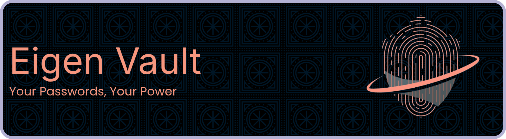

<!-- Banner Image -->

<h1 align="center">Eigen Vault</h1>

<h3 align="center"> Your Passwords, Your Power </h3>  

	

	<!-- 
	 -->
	
	<!-- 
	 -->
	

### Overview

**_Eigen Vault is a personal password manager designed for those who value security, control, and global accessibility—right from your Terminal or browser._**

No subscriptions, no compromise:  

-   [x] Store and organize your credentials with encryption, multi-language support, and seamless access anywhere.

-   [x] Protect your digital identity effortlessly—because true security is in your hands.

---

### Index

| Contents | Links |
| -------- | ----- |
